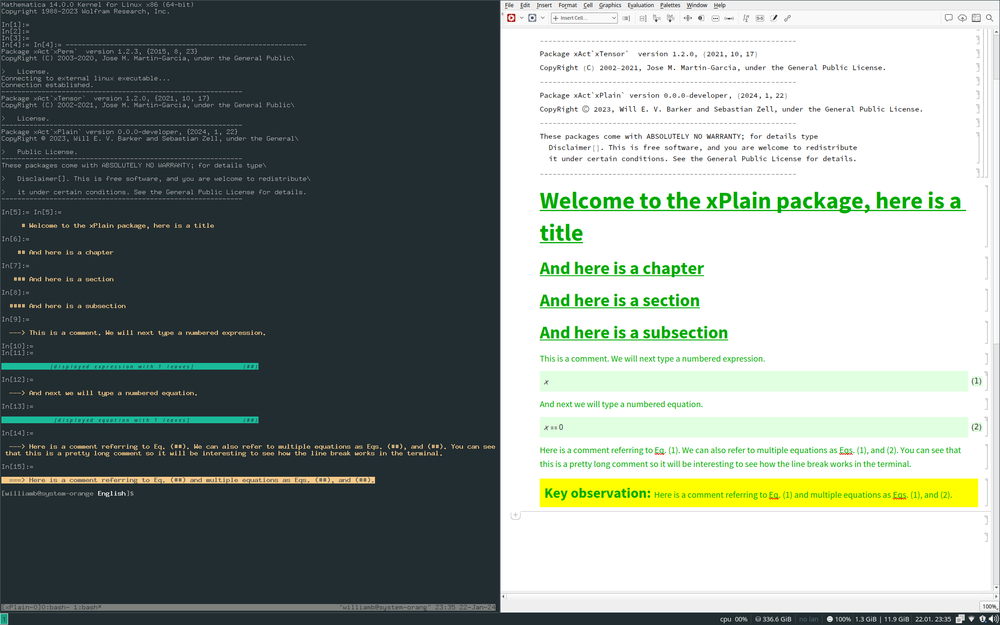

# xPlain 
## Version 0.0.0-developer

## License

Copyright © 2023 Will E. V. Barker and Sebastian Zell 

xPlain is distributed as free software under the [GNU General Public License (GPL)](https://www.gnu.org/licenses/gpl-3.0.en.html).

xPlain is provided without warranty, or the implied warranty of merchantibility or fitness for a particular purpose.

## Motivations 

The xPlain project is motivated by a desire to incorporate the [FAIR guiding principles for scientific data management and stewardship](https://www.go-fair.org/fair-principles/): Findability, Accessibility, Interoperability and Reuse. Whilst these guidelines have typically been applied to numerical data, the physical sciences (and theoretical physics in particular) can rely heavily on symbolic data. There is a trend in theoretical physics to provide *supplemental materials* alongside analytic publications, often comprising one or more Mathematica notebooks which are supposed to corroborate the claims of the author(s). For a variety of reasons, *Mathematica* has a near-monopoly on computer algebra in the theoretical physics community. The popular *notebook* front-end is intended to combine programmatic input of the Wolfram Language with interactive execution and visual output. As with most IDEs, the *notebook* performs none of its duties well: 
- Programmatically, it will always be outperformed by superior tools such as *vim* or *vi*
- Visually, it offers very limited options for paper-style derivations

Computer algebra is one of the very few applications where we really do need a GUI as well as a CLI. The classic case for this is made by tensor calculus, where the proliferation of indices exceeds the capabilities of monospace layouts: the *notebook* is actually quite good at formatting. The question then comes as how to simultaneously do the following: 
- Use the *notebook* purely for its mathematical formatting abilities
- Present your calculations coherently, like a professional physicist
- Work entirely in plaintext, like a professional developer

These are the objectives of the xPlain project. xPlain is an (unofficial) part of the [xAct bundle](http://www.xact.es/). It is designed for the formatting of unambiguous, lasting derivations in the Wolfram language. It is suitable only for those who use the Wolfram Language programmatically. xPlain is a work in progress. The current version was [trialled in some supplemental materials](https://github.com/wevbarker/SupplementalMaterials-2306) and attracted positive comments from the anonymous referee: "*It is remarkable the effort made by the authors with the Supplemental Material to show the connection between the Mathematica code employed for the computations and the statements in the paper. I congratulate the authors for the thorough explanations.*"

## Usage 

Load the package near the top of your Wolfram Language script file:
```
<<xAct`xPlain`;
```
Having done this, you now have access to some new sectioning commands which accept strings as input: 
```mathematica
Title@"Welcome to the xPlain package, here is a title";
Chapter@"And here is a chapter";
Section@"And here is a section";
Subsection@"And here is a subsection";
```
A particularly useful command provides all your commentary:
```mathematica
Comment@"This is a comment. We will next type a numbered expression.";
```
Variables should never be defined as formatted objects. You wouldn't do it in any other language, and you shouldn't do it in the Wolfram Language. Pick a sensible, plaintext name, such as `xx` for your symbol, and if you want it to display nicely, you can do so as follows:
```mathematica
Format@xx^=ToExpression@"\[ScriptX]";
```
Now math can be displayed in xPlain as follows (note we can add a string-valued label to be associated with the counter for the equation number):
```mathematica
DisplayExpression[xx,EqnLabel->"Eq1"];
```
If you have an expression that you have been manipulating and you want it to be understood (by the reader) to vanish, you can use a slight variant of the above environment: 
```mathematica
Comment@"And next we will type a numbered equation.";
DisplayEquation[xx,EqnLabel->"Eq2"];
```
Now we can start to use those equation numbers in the commentary. This time, you need to pass the argument as a list of strings and referenced labels:
```mathematica
Comment@{"Here is a comment referring to",Cref@"Eq1",". We can also refer to multiple equations as",Cref@{"Eq1","Eq2"},". You can see that this is a pretty long comment so it will be interesting to see how the line break works in the terminal."};
```
You can also add more vibrant commentary:
```mathematica
Supercomment@{"Here is a comment referring to",Cref@"Eq1"," and multiple equations as",Cref@{"Eq1","Eq2"},"."};
```
You may be running your Wolfram Language script from the command line, or from a notebook. If you're using a notebook at all, the only thing it should contain is a one-line statement at the top which calls your Wolfram Language script. The output of the above xPlain commands for both the command line interface and the notebook interface is shown in a print-screen below:



## Installation

#### Requirements 

xPlain has been tested in the following environment(s):
- Linux x86 (64-bit), specifically Manjaro and Arch
- Mathematica v 13.1.0.0
- xAct v 1.2.0

#### Install 

1. Make sure you have [installed xAct](http://www.xact.es/download.html).
2. Place the `./xAct/xPlain` directory relative to your xAct install. A global install might have ended up at: 
	```bash
	/usr/share/Mathematica/Applications/xAct
	```

## Contribute

Please do! I'm always responsive to emails (about science), so be sure to reach out at [wb263@cam.ac.uk](mailto:wb263@cam.ac.uk). I will also do my best to get your code working if you are just trying to use xPlain.

## Acknowledgements

This work was performed using resources provided by the Cambridge Service for Data Driven Discovery (CSD3) operated by the University of Cambridge Research Computing Service ([www.csd3.cam.ac.uk](www.csd3.cam.ac.uk)), provided by Dell EMC and Intel using Tier-2 funding from the Engineering and Physical Sciences Research Council (capital grant EP/T022159/1), and DiRAC funding from the Science and Technology Facilities Council ([www.dirac.ac.uk](www.dirac.ac.uk)).

I am grateful for the kind hospitality of Leiden University and the [Lorentz Institute](https://www.lorentz.leidenuniv.nl/), and am supported by [Girton College, Cambridge](https://www.girton.cam.ac.uk/).
