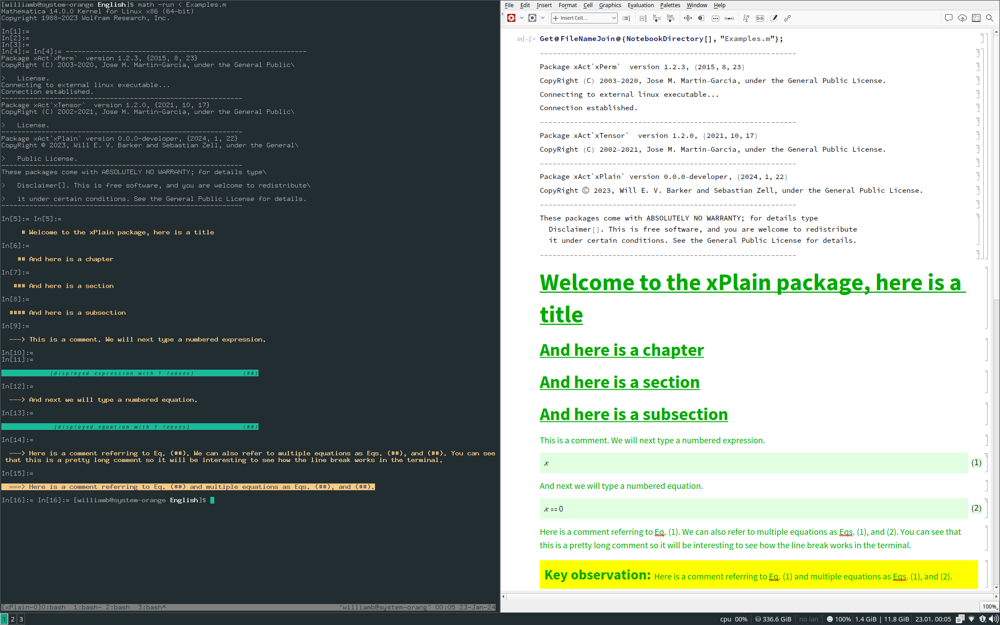

# xPlain 
## Version 0.0.0-developer

## License

Copyright © 2023 Will E. V. Barker and Sebastian Zell 

xPlain is distributed as free software under the [GNU General Public License (GPL)](https://www.gnu.org/licenses/gpl-3.0.en.html).

xPlain is provided without warranty, or the implied warranty of merchantibility or fitness for a particular purpose.

## About

xPlain is an (unofficial) part of the [xAct bundle](http://www.xact.es/). It is designed for the formatting of unambiguous, lasting derivations in the Wolfram language. It is suitable only for those who use the Wolfram Language programatically (i.e. running notebooks how they should be run, purely via plaintext input).

Load the package near the top of your Wolfram Language script file:
```
<<xAct`xPlain`;
```
Having done this, you now have access to some new sectioning commands which acept strings as input: 
```mathematica
Title@"Welcome to the xPlain package, here is a title";
Chapter@"And here is a chapter";
Section@"And here is a section";
Subsection@"And here is a subsection";
```
A particularly useful command provides all your commentary:
```mathematica
Comment@"This is a comment. We will next type a numbered expression.";
```
Variables should never be defined as formatted objects. You wouldn't do it in any other language, and you shouldn't do it in the Wolfram Language. Pick a sensible, plaintext name, such as `xx` for your symbol, and if you want it to display nicely, you can do as follows:
```mathematica
Format@xx^=ToExpression@"\[ScriptX]";
```
Now math can be displayed in xPlain as follows (note we can add a string-valued label to be associated with the counter for the equation number):
```mathematica
DisplayExpression[xx,EqnLabel->"Eq1"];
```
If you have an expression and you want it to be understood to vanish, you can use a slight variant of the above environment: 
```mathematica
Comment@"And next we will type a numbered equation.";
DisplayEquation[xx,EqnLabel->"Eq2"];
```
Now we can start to use those equation numbers in the commentary. This time, you need to pass the argument as a list of strings and referenced labels:
```mathematica
Comment@{"Here is a comment referring to",Cref@"Eq1",". We can also refer to multiple equations as",Cref@{"Eq1","Eq2"},". You can see that this is a pretty long comment so it will be interesting to see how the line break works in the terminal."};
```
You can also add more vibrant commentary:
```mathematica
Supercomment@{"Here is a comment referring to",Cref@"Eq1"," and multiple equations as",Cref@{"Eq1","Eq2"},"."};
```
You may be running your Wolfram Language file from the command line, or from a notebook. If you're using a notebook at all, the only thing it should contain is a one-line statement at the top which calls your Wolfram Language script. The output of the above xPlain commands for both the command line interface and the notebook interface is shown in a print-screen below:


## Installation

#### Requirements 

xPlain has been tested in the following environment(s):
- Linux x86 (64-bit), specifically Manjaro and Arch
- Mathematica v 13.1.0.0
- xAct v 1.2.0

#### Install 

1. Make sure you have [installed xAct](http://www.xact.es/download.html).
2. Place the `./xAct/xPlain` directory relative to your xAct install. A global install might have ended up at: 
	```bash
	/usr/share/Mathematica/Applications/xAct
	```

## Contribute

Please do! I'm always responsive to emails (about science), so be sure to reach out at [wb263@cam.ac.uk](mailto:wb263@cam.ac.uk). I will also do my best to get your code working if you are just trying to use xPlain.

## Acknowledgements

This work was performed using resources provided by the Cambridge Service for Data Driven Discovery (CSD3) operated by the University of Cambridge Research Computing Service ([www.csd3.cam.ac.uk](www.csd3.cam.ac.uk)), provided by Dell EMC and Intel using Tier-2 funding from the Engineering and Physical Sciences Research Council (capital grant EP/T022159/1), and DiRAC funding from the Science and Technology Facilities Council ([www.dirac.ac.uk](www.dirac.ac.uk)).

I am grateful for the kind hospitality of Leiden University and the [Lorentz Institute](https://www.lorentz.leidenuniv.nl/), and am supported by [Girton College, Cambridge](https://www.girton.cam.ac.uk/).
